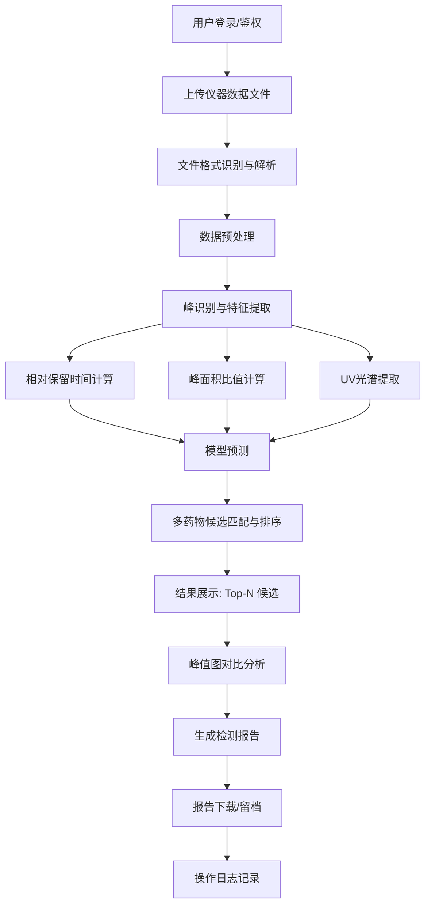

# 第一阶段：需求重新分析

> 项目：HPLC-DAD 药物非法添加快速筛查系统（Web 版）
> 版本：v2.0（由 Tkinter 桌面端升级为 B/S 架构）
> 目标：建设符合现代软件工程规范的实验室智能检测平台

---

## 1. 项目背景与目标

### 1.1 背景

原系统为 Python Tkinter 桌面软件，已实现：

- HPLC-DAD 数据导入与解析
- 相对保留时间（RRT）匹配
- 峰面积比值匹配
- 紫外吸收光谱（UV）匹配
- 贝叶斯概率分类
- 数字对照品库管理
- 基础数据管理

### 1.2 升级目标

**不是简单迁移界面，而是重构为真正的 Web 化实验室平台：**

- 前后端完全分离，RESTful API 通信
- 数据库规范化设计，支持无限峰、无限波长
- 算法模块独立，可单独运行和单元测试
- 引入多药物批量检测（Batch Screening）
- 引入峰值图智能对比（Chromatogram Comparison）
- 支持后续扩展更多检测模型（SVM、神经网络等）
- 符合工业级代码质量、安全、审计、部署规范

---

## 2. 业务流程（Business Flow）



### 2.1 流程说明

1. **登录鉴权**：JWT Token + RBAC 权限控制
2. **上传文件**：支持 TXT/CSV/Excel，按仪器厂商自动选择解析器
3. **文件解析**：ParserFactory 根据文件头/扩展名路由到对应解析器
4. **数据预处理**：基线校正、去噪、平滑、归一化
5. **峰识别**：基于 SciPy 寻找局部极大值，计算保留时间、峰面积、峰高、半峰宽
6. **特征计算**：RRT、峰面积比、UV 光谱向量
7. **模型预测**：RRT 模型、峰面积比模型、UV 距离模型、贝叶斯融合模型
8. **多药物匹配**：样本全部峰 vs 对照品库全部药物，输出 Top-N 候选及混合添加识别
9. **结果展示**：候选药物列表、概率、匹配峰信息
10. **峰值图对比**：标准品与待测品双图联动，自动计算 ΔRT、面积差异
11. **报告生成**：PDF/Word 格式，含峰图、结果表、风险等级
12. **日志记录**：所有操作、检测、异常均写入操作日志

---

## 3. 系统模块划分

```
system/
├── 用户模块 (user)
│   ├── 登录/登出
│   ├── JWT 鉴权
│   └── 角色权限管理 (admin/operator)
├── 数据库模块 (library)
│   ├── 药物信息管理
│   ├── 峰库管理
│   ├── 光谱库管理
│   └── 模型参数管理
├── 文件模块 (file)
│   ├── 文件上传
│   ├── 仪器格式识别
│   └── TXT/CSV/Excel 解析
├── 算法模块 (algorithm)
│   ├── 预处理 (preprocess)
│   ├── 峰检测 (peak_detect)
│   ├── 相对保留时间 (retention)
│   ├── 峰面积比值 (area_ratio)
│   ├── UV 光谱匹配 (uv_match)
│   ├── 贝叶斯分类 (bayes)
│   ├── 模型融合 (fusion)
│   └── 报告生成 (report)
├── 检测模块 (detection)
│   ├── 单样本检测
│   ├── 多药物批量检测
│   ├── 异步任务调度
│   └── 结果查询
├── 报告模块 (report)
│   ├── 检测结果报告
│   ├── 峰值图对比报告
│   └── PDF/Word/Excel 导出
├── 日志模块 (log)
│   ├── 操作日志
│   ├── 检测日志
│   └── 异常日志
└── 系统配置模块 (config)
    ├── 阈值参数配置
    ├── 仪器解析器配置
    └── 系统备份
```

---

## 4. 用户角色与权限

| 角色 | 权限 |
|------|------|
| admin（管理员） | 用户管理、数据库管理、系统配置、查看所有日志、删除数据 |
| operator（操作员） | 上传样品、执行检测、查看结果、导出报告、查看本人操作日志 |

---

## 5. 功能需求

### 5.1 用户模块

- FR-USER-001：用户可通过用户名/密码登录
- FR-USER-002：密码须加密存储（bcrypt）
- FR-USER-003：登录后返回 JWT Token
- FR-USER-004：Token 过期后需重新登录
- FR-USER-005：admin 可创建/编辑/禁用用户
- FR-USER-006：不同角色访问不同菜单

### 5.2 数据库模块（对照品库）

- FR-LIB-001：管理药物基本信息（名称、类别、描述）
- FR-LIB-002：管理药物的峰库（每个峰一条记录，含保留时间、相对保留时间、峰面积比、峰高、半峰宽）
- FR-LIB-003：管理药物光谱库（每个波长一条记录，含波长、吸光度）
- FR-LIB-004：支持按药物类别筛选
- FR-LIB-005：支持 Excel 批量导入对照品库
- FR-LIB-006：支持对照品库版本管理（可选）

### 5.3 文件模块

- FR-FILE-001：支持上传 TXT/CSV/Excel 文件
- FR-FILE-002：单文件大小限制 50MB
- FR-FILE-003：文件类型白名单校验
- FR-FILE-004：根据文件扩展名/内容自动识别仪器格式
- FR-FILE-005：解析失败返回明确错误信息
- FR-FILE-006：解析结果保存为中间数据结构

### 5.4 算法模块

- FR-ALG-001：数据预处理支持基线校正、去噪、平滑、归一化
- FR-ALG-002：峰检测基于 SciPy，可配置最小峰高、最小峰距
- FR-ALG-003：相对保留时间模型计算匹配概率
- FR-ALG-004：峰面积比值模型计算匹配概率
- FR-ALG-005：UV 光谱模型基于欧氏距离/相关系数计算匹配度
- FR-ALG-006：贝叶斯模型融合多特征概率
- FR-ALG-007：算法输入输出为 Python 对象，不依赖 Flask/Vue/数据库
- FR-ALG-008：算法模块可单独运行单元测试

### 5.5 检测模块

- FR-DET-001：支持单样本检测
- FR-DET-002：支持多文件批量上传检测
- FR-DET-003：支持一次检测同时匹配全部对照品药物
- FR-DET-004：输出 Top-N 候选药物（默认 Top 10）
- FR-DET-005：支持混合非法添加识别（一个样本检出多种药物）
- FR-DET-006：检测任务异步执行，前端轮询结果
- FR-DET-007：检测状态包括：pending/running/success/failed
- FR-DET-008：保存每个样本的峰、检测结果、匹配明细

### 5.6 峰值图对比模块

- FR-CP-001：选择标准品和待测样品进行对比
- FR-CP-002：左右双图展示色谱图
- FR-CP-003：双图支持 dataZoom、axisPointer、tooltip 联动
- FR-CP-004：自动识别并配准对应峰
- FR-CP-005：计算并显示 ΔRT、面积差异百分比
- FR-CP-006：匹配峰绿色、偏差峰黄色、异常峰红色

### 5.7 报告模块

- FR-RPT-001：生成单样本检测报告
- FR-RPT-002：生成批量检测汇总报告
- FR-RPT-003：报告包含：样品信息、检测方法、候选药物、概率、峰图
- FR-RPT-004：支持导出 PDF/Word/Excel
- FR-RPT-005：报告文件名包含样品编号和检测时间

### 5.8 日志模块

- FR-LOG-001：记录用户登录/登出
- FR-LOG-002：记录样品上传、检测、删除
- FR-LOG-003：记录对照品库增删改
- FR-LOG-004：记录系统配置变更
- FR-LOG-005：管理员可查询所有日志，操作员仅查询本人日志

### 5.9 系统配置模块

- FR-CFG-001：配置 RRT 容差阈值
- FR-CFG-002：配置 UV 距离阈值
- FR-CFG-003：配置峰面积概率阈值
- FR-CFG-004：配置 Top-N 数量
- FR-CFG-005：配置检测模型权重

---

## 6. 创新功能详细设计

### 6.1 多药物批量检测（Batch Screening）

#### 目标

突破原系统“一个峰 → 一种药”的限制，实现：

- 一个样本的全部峰与对照品库全部药物进行匹配
- 输出 Top-N 候选药物
- 识别样本中可能存在的多种非法添加物

#### 处理流程

```
样本 S（含 n 个峰）
    ↓
对照品库 D（含 m 种药物，每种药物含 k 个峰）
    ↓
for each drug in D:
    for each peak in drug.peaks:
        在样本 S 中寻找最匹配的峰
        计算 RRT 概率、面积比概率、UV 匹配度
    综合该药物所有峰得到药物级评分
    ↓
按评分排序，输出 Top-N
    ↓
对 Top-N 中超过阈值的药物标记为"检出"
```

#### 输出示例

| 排名 | 药物名称 | 综合概率 | 匹配峰数 | 主要匹配峰 RT | 风险等级 |
|------|----------|----------|----------|---------------|----------|
| 1 | 西地那非 | 98.5% | 3/4 | 5.321, 8.102, 12.445 | 高 |
| 2 | 他达拉非 | 94.2% | 2/3 | 6.112, 10.231 | 高 |
| 3 | 酚酞 | 89.0% | 2/2 | 4.876, 7.543 | 中 |

### 6.2 峰值图智能对比（Chromatogram Comparison）

#### 目标

为实验人员提供直观的标准品与样品色谱图对比工具，支持：

- 双图联动缩放
- 自动峰位配准
- 自动计算差异指标

#### 交互设计

- 左侧：标准品色谱图（来自对照品库）
- 右侧：待测样品色谱图（来自上传文件）
- 同步：dataZoom、axisPointer、tooltip 联动
- 峰位：自动标注重合峰，计算 ΔRT
- 颜色：
  - 绿色：完全匹配（ΔRT < 阈值且面积差异 < 阈值）
  - 黄色：轻微偏差（ΔRT 或面积差异超出阈值但可接受）
  - 红色：显著异常（未找到对应峰或差异过大）

---

## 7. 非功能需求

### 7.1 性能

- NFR-PERF-001：单文件解析 < 10 秒（10MB 以内）
- NFR-PERF-002：单样本检测 < 30 秒（对照品库 100 种药物）
- NFR-PERF-003：批量检测使用 Celery 异步队列，前端不阻塞
- NFR-PERF-004：数据库查询使用索引优化

### 7.2 安全

- NFR-SEC-001：密码使用 bcrypt 加密
- NFR-SEC-002：JWT Token 设置合理过期时间
- NFR-SEC-003：上传文件校验扩展名和大小
- NFR-SEC-004：SQL 注入防护（使用 SQLAlchemy ORM）
- NFR-SEC-005：接口 RBAC 权限控制
- NFR-SEC-006：操作日志完整审计
- NFR-SEC-007：生产环境启用 HTTPS

### 7.3 可维护性

- NFR-MAINT-001：Controller 只处理请求/响应
- NFR-MAINT-002：Service 封装业务逻辑
- NFR-MAINT-003：DAO 负责数据库访问
- NFR-MAINT-004：Algorithm 只负责计算
- NFR-MAINT-005：Utils 只放通用工具函数
- NFR-MAINT-006：代码符合 PEP8，带中文注释
- NFR-MAINT-007：关键函数必须有单元测试

### 7.4 可扩展性

- NFR-EXT-001：新增仪器格式只需新增 Parser 类
- NFR-EXT-002：新增检测模型只需新增 Algorithm 模块
- NFR-EXT-003：新增数据库字段不破坏现有接口

### 7.5 兼容性

- NFR-COMP-001：前端支持 Chrome/Firefox/Edge 最新版
- NFR-COMP-002：后端支持 Python 3.11+
- NFR-COMP-003：数据库支持 MySQL 8.0+

---

## 8. 数据文件格式要求

### 8.1 仪器数据文件

系统至少支持以下格式：

- Agilent `.csv`/`.txt`
- Waters `.txt`/`.csv`
- Shimadzu `.txt`/`.csv`
- 通用 `.csv`（至少包含 Time、Absorbance 或波长矩阵）

### 8.2 对照品库导入文件

Excel 文件，至少包含三个 Sheet：

- `drugs`：药物基本信息
- `peaks`：峰库（drug_id, peak_index, retention_time, relative_rt, area_ratio, ...）
- `spectra`：光谱库（drug_id, wavelength, absorbance）

---

## 9. 算法接口规范（输入输出）

所有算法模块必须遵循以下接口规范：

```python
# 示例：相对保留时间模型
def rrt_match(
    sample_peaks: List[SamplePeak],
    ref_peaks: List[RefPeak],
    config: RRTConfig
) -> RRTResult:
    """
    输入：样本峰列表、对照品峰列表、配置
    输出：RRT 匹配结果对象
    """
    pass
```

- 输入：Python 数据对象（dataclass / Pydantic / dict）
- 输出：Python 数据对象
- 禁止：依赖 Flask、SQLAlchemy、文件路径、HTTP 请求

---

## 10. 验收标准

- [ ] 用户可正常登录并执行 RBAC 权限控制
- [ ] 可上传 TXT/CSV/Excel 并正确解析
- [ ] 可执行单样本检测并输出 Top-N 候选
- [ ] 可执行批量检测且不阻塞前端
- [ ] 可展示峰值图对比并联动缩放
- [ ] 可导出 PDF/Word/Excel 报告
- [ ] 数据库满足第三范式，无 Peak1/Peak2 等反范式字段
- [ ] 算法模块可独立运行单元测试
- [ ] 所有 API 返回统一 JSON 格式
- [ ] 操作日志完整可审计

---

## 11. 下一阶段预告

第二阶段：数据库规范化设计

- 设计 `drugs`、`spectra`、`peak_library`、`samples`、`sample_peaks`、`detection_results` 等核心表
- 确保满足第三范式
- 输出 `backend/sql/schema.sql` 与 `backend/app/model/` 模型代码
