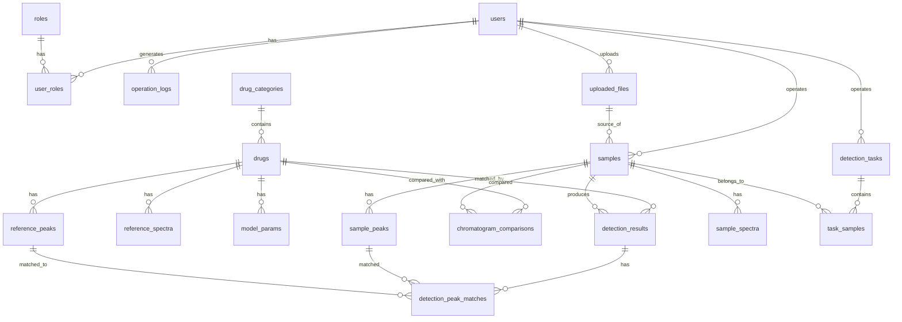

# 第二阶段：数据库规范化设计

> 目标：为 HPLC-DAD 药物非法添加筛查 Web 平台设计满足第三范式的关系型数据库。

---

## 1. 设计原则

1. **第三范式（3NF）**：每个表只描述一个实体，字段之间不存在传递依赖。
2. **峰与光谱原子化**：一个峰一条记录，一个波长一条记录，禁止 `Peak1/Peak2/Peak3` 这类字段。
3. **样本与对照品库解耦**：样本数据与对照品库数据物理隔离，检测结果通过外键关联。
4. **支持批量异步检测**：`detection_tasks` + `task_samples` 支持 Celery 后台任务。
5. **可审计与 RBAC**：`users`、`roles`、`user_roles`、`operation_logs` 支持权限与审计。
6. **配置外置**：`system_configs` 保存阈值、权重等运行时配置。

---

## 2. 实体关系图（ERD）

---

## 3. 核心表说明

### 3.1 用户与权限

| 表名 | 说明 |
|------|------|
| `users` | 用户基本信息 |
| `roles` | 角色定义（admin、operator） |
| `user_roles` | 用户角色多对多关联 |

### 3.2 对照品库

| 表名 | 说明 |
|------|------|
| `drug_categories` | 药物类别（如：安神镇定类、减肥类） |
| `drugs` | 药物基本信息 |
| `reference_peaks` | 峰库：每种药物的每个峰一条记录 |
| `reference_spectra` | 光谱库：每种药物的每个波长一条记录 |
| `model_params` | 模型参数：按药物+模型类型存储 JSON 参数 |

### 3.3 样本与检测

| 表名 | 说明 |
|------|------|
| `uploaded_files` | 上传文件记录 |
| `samples` | 检测样本 |
| `sample_peaks` | 样本识别出的峰 |
| `sample_spectra` | 样本原始 DAD 光谱数据（可选，按 retention_time + wavelength 存储） |
| `detection_tasks` | 批量检测任务 |
| `task_samples` | 任务与样本关联 |
| `detection_results` | 检测结果：样本 vs 药物的综合评分 |
| `detection_peak_matches` | 峰级匹配明细 |
| `chromatogram_comparisons` | 峰值图对比记录 |

### 3.4 系统与日志

| 表名 | 说明 |
|------|------|
| `system_configs` | 系统配置（阈值、权重等） |
| `operation_logs` | 操作日志 |

---

## 4. 关键设计决策

### 4.1 为什么峰库与样本峰分开？

- `reference_peaks` 是对照品库，稳定、可维护。
- `sample_peaks` 是每次上传样本后动态识别出的峰，生命周期与样本绑定。
- 分开后可避免样本数据污染对照品库，也便于历史样本回溯。

### 4.2 为什么引入 `detection_tasks`？

- 多药物批量检测可能涉及多个样本、大量计算。
- 通过任务表可以：
  - 前端提交任务后立即返回任务 ID
  - Celery 后台异步执行
  - 前端轮询任务进度
  - 记录批量检测历史

### 4.3 为什么 `reference_spectra` 按波长存储？

- 原桌面系统可能将光谱作为字段存储。
- 按波长原子化存储后：
  - 支持任意波长数量
  - 便于按波长范围查询
  - 便于与样本光谱逐点对比

### 4.4 模型参数为什么用 JSON？

- 不同模型（RRT、峰面积比、UV、贝叶斯、SVM）参数差异大。
- JSON 可灵活存储均值、协方差、阈值、权重等，同时保留 `drug_id` 和 `model_type` 作为查询键。

---

## 5. 索引设计

| 表 | 索引字段 | 目的 |
|----|----------|------|
| `users` | `username` | 唯一、登录查询 |
| `drugs` | `category_id` | 按类别筛选 |
| `reference_peaks` | `drug_id` | 快速获取某药物全部峰 |
| `reference_spectra` | `drug_id` | 快速获取某药物全部光谱 |
| `samples` | `operator_id`, `status` | 按操作员和状态查询 |
| `sample_peaks` | `sample_id` | 快速获取样本峰 |
| `sample_spectra` | `sample_id, retention_time`, `sample_id, wavelength` | 快速绘制色谱图/光谱图 |
| `detection_results` | `sample_id`, `task_id`, `drug_id` | 结果查询 |
| `detection_peak_matches` | `result_id` | 明细查询 |
| `operation_logs` | `user_id`, `created_at` | 审计查询 |

---

## 6. 下一阶段

第三阶段：算法模块封装

- 在 `backend/app/algorithm/` 下建立独立算法模块
- 输入输出为 Python 对象，不依赖 Flask/数据库/HTTP
- 包括：preprocess、peak_detect、retention、area_ratio、uv_match、bayes、fusion、report
